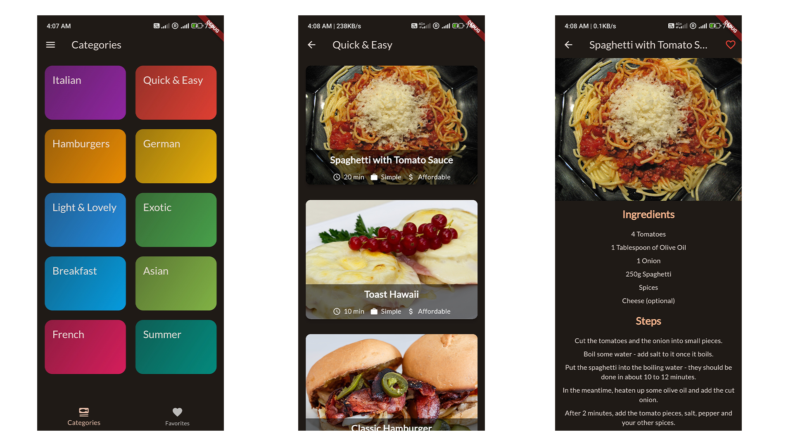
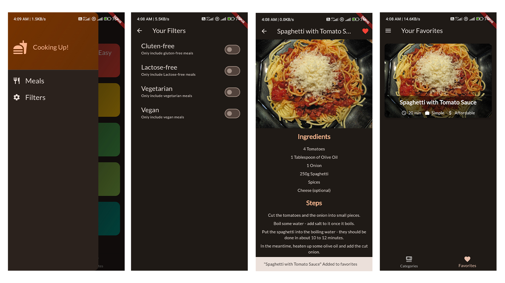

# Meals App
This application is a very simple application designed to learn some of the basics 
of the Flutter language, which is a food recipe program designed to deal with the user
interface and navigate between different screens

## Screenshots

  

  

  

## Features

This ِApp contains multi screens:
`ِCategories Screen` It contains all your meals categories in list  
`ِMeals screen` This screen contains a ListView containing the dishes in this category  
and more..

## Main Features

* dart
* flutter 
* google_fonts: 6.2.1
* transparent_image: 2.0.1
* flutter_riverpod: 2.5.1
